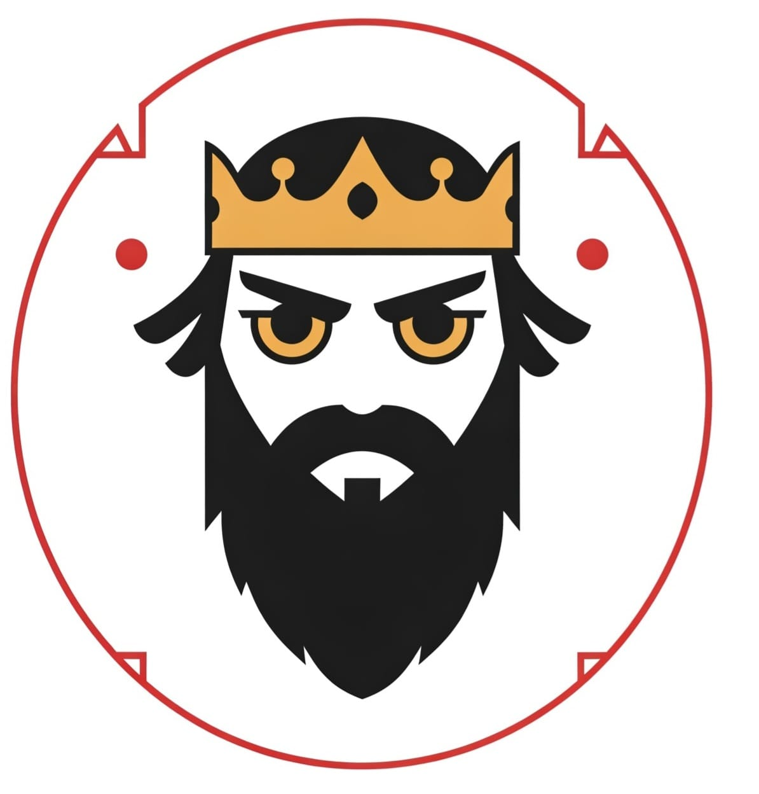

  

# 🌟 Sultan Bashammakh's Portfolio

Welcome to my professional portfolio built with Laravel! This website showcases my projects, skills, and development experience.

## 🎯 Features
- **Project Showcase**: Filterable gallery of my work
- **Interactive Resume**: Timeline of my education and experience
- **Contact Form**: Secure message submission with Laravel validation
- **Dark/Light Mode**: Tailwind CSS-powered theme switching
- **Responsive Design**: Works on all devices

## 🛠 Tech Stack
| Area          | Technologies Used |
|---------------|-------------------|
| **Backend**   | Laravel 10, PHP 8.2 |
| **Frontend**  | Blade, Tailwind CSS, Alpine.js |
| **Database**  | MySQL, Eloquent ORM |
| **DevOps**    | GitHub Actions, Docker |
| **APIs**      | RESTful endpoints |

## 📌 Key Pages
- `/` - Homepage with featured projects
- `/portfolios` - Filterable project gallery
- `/about` - Interactive timeline
- `/contact` - Secure message form

## 🌐 Live Demo
Access the live portfolio at:  
(https://sultan-portfolio-main-ojexfk.laravel.cloud/)

## 🤝 Contact Me
- 📧 Email: [Sulttan.m.b@hotmail.com](mailto:Sulttan.m.b@hotmail.com)
- 💼 LinkedIn: [linkedin.com/in/sultanbashammakh](https://linkedin.com/in/sultanbashammakh)
- 🐙 GitHub: [github.com/Sallot27](https://github.com/Sallot27)
